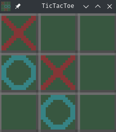

# Tic-Tac-Toe

This is a Godot implementation of TicTacToe, with the logic written in Rust,
primarily for learning purposes.

Please direct all issues and pull requests to the
[gitlab](https://gitlab.com/donottellmetonottellyou/tic-tac-toe).

As stated in the [LICENSE](./LICENSE), the code in this repository can be used
for any purpose.
